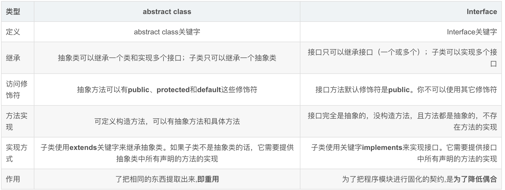

# BASIC QUESTIONS

> HashMap的源码，实现原理，JDK8中对HashMap做了怎样的优化

TODO
> HaspMap扩容是怎样扩容的，为什么都是2的N次幂的大小

为了保证hash散列平稳 hash & (tab.length-1)
> HashMap，HashTable，ConcurrentHashMap的区别

TODO
> 极高并发下HashTable和ConcurrentHashMap哪个性能更好，为什么，如何实现的

Hashtable
> HashMap在高并发下如果没有处理线程安全会有怎样的安全隐患，具体表现是什么

闭环, 数据覆盖
> java中四种修饰符的限制范围

- private 私有
- 无修饰符 本类 + 本包
- protected 本类 + 子类
- public 都可以访问

> Object类中的方法

``` java
private static native void registerNatives();
public final native Class<?> getClass();
public native int hashCode();
public boolean equals(Object obj) {
    return (this == obj);
}
protected native Object clone() throws CloneNotSupportedException;
public String toString() {
    return getClass().getName() + "@" + Integer.toHexString(hashCode());
}
public final native void notify();
public final native void notifyAll();
public final native void wait(long timeout) throws InterruptedException;
public final void wait(long timeout, int nanos) throws InterruptedException {
     if (timeout < 0) {
        throw new IllegalArgumentException("timeout value is negative");
    }

    if (nanos < 0 || nanos > 999999) {
          throw new IllegalArgumentException(
                              "nanosecond timeout value out of range");
    }

    if (nanos > 0) {
        timeout++;
    }

    wait(timeout);
}
public final void wait() throws InterruptedException {
    wait(0);
}
protected void finalize() throws Throwable { }
```

> Java序列化的方式

实现Serialize接口
> 传值和传引用的区别，Java是怎么样的，有没有传值引用

final传值
> 一个ArrayList在循环过程中删除，会不会出问题，为什么

会出现ConcureentModificationException, 需要用iterator来实现遍历删除
> @Transactional注解在什么情况下会失效，为什么

1. @Transactional 应用在非 public 修饰的方法上
2. @Transactional 注解属性 propagation 设置错误
3. @Transactional 注解属性 rollbackFor 设置错误
4. 同一个类中方法调用，导致@Transactional失效
5. 异常被你的 catch“吃了”导致@Transactional失效
6. 数据库引擎不支持事务

> java反射中，Class.forName和classloader的区别?

- class.forName()和classLoader都可用来对类进行加载。  
- class.forName()除了将类的.class文件加载到jvm中之外，还会对类进行解释，执行类中的static块。
- 而classLoader只干一件事情，就是将.class文件加载到jvm中，不会执行static中的内容,只有在newInstance才会去执行static块。
- Class.forName(name, initialize, loader)带参函数也可控制是否加载static块。并且只有调用了newInstance()方法采用调用构造函数，创建类的对象

```java
 public static Class<?> forName(String className) throws ClassNotFoundException {
    Class<?> caller = Reflection.getCallerClass();
    return forName0(className, true, ClassLoader.getClassLoader(caller), caller);
}
```

> Spring事务

- PROPAGATION_REQUIRED: 表示当前方法必须运行在事务中。如果当前事务存在，方法将会在该事务中运行。否则，会启动一个新的事务
- PROPAGATION_SUPPORTS: 表示当前方法不需要事务上下文，但是如果存在当前事务的话，那么该方法会在这个事务中运行
- PROPAGATION_MANDATORY: 表示该方法必须在事务中运行，如果当前事务不存在，则会抛出一个异常
- PROPAGATION_REQUIRED_NEW: 表示当前方法必须运行在它自己的事务中。一个新的事务将被启动。如果存在当前事务，在该方法执行期间，当前事务会被挂起。如果使用JTATransactionManager的话，则需要访问TransactionManager
- PROPAGATION_NOT_SUPPORTED: 表示该方法不应该运行在事务中。如果存在当前事务，在该方法运行期间，当前事务将被挂起。如果使用JTATransactionManager的话，则需要访问TransactionManager
- PROPAGATION_NEVER: 表示当前方法不应该运行在事务上下文中。如果当前正有一个事务在运行，则会抛出异常
- PROPAGATION_NESTED: 表示如果当前已经存在一个事务，那么该方法将会在嵌套事务中运行。嵌套的事务可以独立于当前事务进行单独地提交或回滚。如果当前事务不存在，那么其行为与PROPAGATION_REQUIRED一样。

> OOM问题和StackOverflow有什么区别

- 如果线程请求的栈深度大于虚拟机所允许的最大深度，会抛出StackOverFlow内存溢出异常。
- 如果虚拟机在拓展栈时无法申请到足够的内存空间，则会抛出OOM泄露异常。

> Java中的几种基本数据类型是什么? 各占用多少字节?


> String类可以被继承吗? 为什么

不可以, String类是被final关键字修饰的类, 无法被继承

1. 修饰类: 当用final修饰一个类时，表明这个类不能被继承。final类中的成员变量可以根据需要设为final，但是要注意final类中的所有成员方法都会被隐式地指定为final方法。
2. 修饰方法: 使用final修饰方法的原因有两个。第一个原因是把方法锁定，以防任何继承类修改它的含义；第二个原因是效率。在早期的Java实现版本中，会将final方法转为内嵌调用。但是如果方法过于庞大，可能看不到内嵌调用带来的任何性能提升。在最近的Java版本中，不需要使用final方法进行这些优化了。
3. 修饰变量: 对于被final修饰的变量，如果是基本数据类型的变量，则其数值一旦在初始化之后便不能更改；如果是引用类型的变量，则在对其初始化之后便不能再让其指向另一个对象。虽然不能再指向其他对象，但是它指向的对象的内容是可变的。

> String, StringBuffer和StringBuilder的区别

运算速度比较（通常情况下）：StringBuilder > StringBuffer > String

String：适用于少量的字符串操作。

StringBuilder：适用于单线程下在字符串缓冲区进行大量操作。

StringBuffer：适用于多线程下在字符串缓冲区进行大量操作。

> ArrayList和LinkedList有什么区别?

1. ArrayList是实现了基于动态数组的数据结构，LinkedList基于链表的数据结构。
2. 对于随机访问get和set，ArrayList绝对优于LinkedList，因为LinkedList要移动指针。
3. 对于新增和删除操作add和remove，LinedList比较占优势，因为ArrayList要移动数据。

> 类的实例化顺序: 父类静态数据, 构造函数, 字段, 子类静态数据, 构造函数, 字段, 当new的时候, 他们的执行顺序?

1. 首先会执行类中static代码块(不管代码块是否在类的开头还是末尾处)，如果这个类有父类，同样会优先查找父类中的static代码块，然后是当前类的static。
2. 然后会从父类的第一行开始执行，直至代码末尾处，中间不管是有赋值还是method调用，都会按顺序一一执行（method），普通代码块{ }...
3. 其次才是父类的构造函数，执行带参数或不带参数的构造函数，依赖于实例化的类的构造函数有没有super父类的带参或不带参的构造函数，上边试验二三已经证明。
4. 然后会从子类（当前类）的第一行开始执行，直至代码末尾处，中间不管是有赋值还是method调用，都会按顺序一一执行（method），普通代码块{ }...
5. 其次会是子类（当前类）的构造函数，按顺序执行。
6. 最后是类方法的调用执行，如果子类覆盖了父类的method，执行时会先执行子类覆盖的method，method内如果有super.method()，才会调用父类的同名method，否则不会。

总结：父类静态成员和静态代码块->子类静态成员和静态代码块->父类非静态成员和非静态代码块->父类构造方法->子类非静态成员和非静态代码块->子类构造方法

> 用过哪些Map类, 都有什么区别? HashMap是线程安全的吗?并发下使用的map是什么? 内部原理分别是什么? (存储方式, hashcode, 扩容, 默认容量等)

HashMap, LinkedHashMap, ConcurrentHashMap, TreeMap  
HashMap是非线程安全的, 并发场景下用ConcurrentHashMap

> JDK1.8的ConcurrentHashMap放弃了分段锁, 为什么? 如果你来设计, 你如何设计?

在JAVA的jdk1.8中则对ConcurrentHashMap又再次进行了大的修改，取消了segment段锁字段，采用了CAS+Synchronize技术来保障线程安全。

> 有没有有顺序的Map实现类, 如果有, 是怎么保证顺序的?

1. LinkedHashMap 继承自 HashMap，所以它的底层仍然是基于拉链式散列结构。该结构由数组和链表+红黑树 在此基础上LinkedHashMap 增加了一条双向链表，保持遍历顺序和插入顺序一致的问题。
2. 在实现上，LinkedHashMap 很多方法直接继承自 HashMap（比如put  remove方法就是直接用的父类的），仅为维护双向链表覆写了部分方法（get（）方法是重写的）。
3. LinkedHashMap使用的键值对节点是Entity 他继承了hashMap 的Node,并新增了两个引用，分别是 before 和 after。这两个引用的用途不难理解，也就是用于维护双向链表.
4. 链表的建立过程是在插入键值对节点时开始的，初始情况下，让 LinkedHashMap 的 head 和 tail 引用同时指向新节点，链表就算建立起来了。随后不断有新节点插入，通过将新节点接在 tail 引用指向节点的后面，即可实现链表的更新
5. LinkedHashMap 允许使用null值和null键， 线程是不安全的，虽然底层使用了双线链表，但是增删相快了。因为他底层的Entity 保留了hashMap  node 的next 属性。
6. 如何实现迭代有序: 重新定义了数组中保存的元素Entry（继承于HashMap.node)，该Entry除了保存当前对象的引用外，还保存了其上一个元素before和下一个元素after的引用，从而在哈希表的基础上又构成了双向链接列表。仍然保留next属性，所以既可像HashMap一样快速查找，用next获取该链表下一个Entry，也可以通过双向链接，通过after完成所有数据的有序迭代.
7. 竟然inkHashMap 的put 方法是直接调用父类hashMap的，但在 HashMap 中，put 方法插入的是 HashMap 内部类 Node 类型的节点，该类型的节点并不具备与 LinkedHashMap 内部类 Entry 及其子类型节点组成链表的能力。那么，LinkedHashMap 是怎样建立链表的: 虽然linkHashMap 调用的是hashMap中的put 方法，但是linkHashMap 重写了，了一部分方法，其中就有 `newNode(int hash, K key, V value, Node<K,V> e)`, `linkNodeLast(LinkedHashMap.Entry<K,V> p)`; 这两个方法就是: 第一个方法就是新建一个 linkHasnMap 的Entity 方法，而 linkNodeLast 方法就是为了把Entity 接在链表的尾部。
8. 链表节点的删除过程: 与插入操作一样，LinkedHashMap 删除操作相关的代码也是直接用父类的实现，但是LinkHashMap 重写了removeNode()方法 afterNodeRemoval（）方法，该removeNode方法在hashMap 删除的基础上有调用了afterNodeRemoval 回调方法。完成删除。

删除的过程并不复杂，上面这么多代码其实就做了三件事：

- 根据 hash 定位到桶位置
- 遍历链表或调用红黑树相关的删除方法
- 从 LinkedHashMap 维护的双链表中移除要删除的节点

> 抽象类和接口的区别, 类可以继承多个类吗, 接口可以继承多个接口吗, 类可以实现多个接口吗?

- 相同点:
  1. 都不能被实例化。
  2. 接口的实现类和抽象类的子类只有全部实现了接口或者抽象类中的方法后才可以被实例化。  
- 不同点：  
  1. 接口只能定义抽象方法不能实现方法，抽象类既可以定义抽象方法，也可以实现方法。
  2. 单继承，多实现。接口可以实现多个，只能继承一个抽象类。
  3. 接口强调的是功能，抽象类强调的是所属关系。
  4. 接口中的所有成员变量 为public static final， 静态不可修改，当然必须初始化。接口中的所有方法都是public abstract 公开抽象的。而且不能有构造方法。抽象类就比较自由了，和普通的类差不多，可以有抽象方法也可以没有，可以有正常的方法，也可以没有。



> 继承和聚合的区别在哪?

继承：他是is-a的关系，指一个类继承另外一个类的功能  
聚合：他是has-a　 
组合：他是contans-a（强聚合）

> IO模型有哪些? 讲讲你理解的NIO, 与BIO和AIO之间的区别是什么? 谈谈Reactor模型

- 什么是BIO,NIO,AIO
  1. JAVA BIO：同步并阻塞，服务器实现模式为一个连接一个线程，即客户端有连接请求时服务器端就需要启动一个线程并处理，如果这个连接不做任何事情会造成不必要的开销，可以通过线程池机制改善
  2. JAVA NIO：同步非阻塞，服务器实现模式为一个请求一个线程，即客户端发送的连接请求都会注册到多路复用器上，多路复用器轮询到连接有IO请求时才启动一个线程进行处理
  3. JAVA AIO(NIO2)：异步非阻塞，服务器实现模式为一个有效请求一个线程，客户端的I/O请求都是由OS先完成了再通知服务器应用去启动线程进行处理
- 使用场景
  1. BIO方式适用于连接数目比较小且固定的架构，这种方式对服务器资源要求比较高，并发局限于应用中，JDK1.4以前的唯一选择，但程序直观简单易理解。
  2. NIO方式适用于连接数目多且连接比较短（轻操作）的架构，比如聊天服务器，并发局限于应用中，编程比较复杂，JDK1.4开始支持。
  3. AIO方式使用于连接数目多且连接比较长（重操作）的架构，比如相册服务器，充分调用OS参与并发操作，编程比较复杂，JDK1.7开始支持。
- BIO 同步并阻塞
  - tomcat采用的传统的BIO（同步阻塞IO模型）+线程池模式，对于十万甚至百万连接的时候，传统BIO模型是无能为力的：
    1. 线程的创建和销毁成本很高，在linux中，线程本质就是一个进程，创建销毁都是重量级的系统函数
    2. 线程本身占用较大的内存，像java的线程栈一般至少分配512K-1M的空间，如果系统线程过高，内存占用是个问题
    3. 线程的切换成本高，操作系统发生线程切换的时候，需要保留线程的上下文，然后执行系统调用，如果线程数过高可能执行线程切换的时间甚至大于线程执行的时间，这时候带来的表现是系统load偏高，CPU使用率很高
    4. 容易造成锯齿状的系统负载。系统负载是用活动线程数或CPU核心数，一旦线程数量高但外部网络环境不是很稳定，就很容易造成大量请求的结果同时返回，激活大量阻塞线程从而使系统负载压力过大。
- NIO同步非阻塞
  - NIO基于Reactor，当socket有流可读或可写入socket，操作系统会相应的通知引用程序进行处理，应用再将流读取到缓冲区或写入操作系统。也就是，不是一个链接就要对应一个处理线程，而是一个有效请求对应一个线程，当连接没有数据时，是没有工作线程来处理的
- Reactor模型
  - nio只有acceptor的服务线程是堵塞进行的，其他读写线程是通过注册事件的方式，有读写事件激活时才调用线程资源区执行，不会一直堵塞等着读写操作，Reactor的瓶颈主要在于acceptor的执行，读写事件也是在这一块分发
- AIO异步非堵塞IO
  - AIO需要一个链接注册读写事件和回调方法，当进行读写操作时，只须直接调用API的read或write方法即可，这两种方法均为异步，对于读操作而言，当有流可读取时，操作系统会将可读的流传入read方法的缓冲区，并通知应用程序；对于写操作而言，当操作系统将write方法传递的流写入完毕时，操作系统主动通知应用程序
  - read/write方法都是异步的，完成后会主动调用回调函数

> 反射的原理? 反射创建类实例的三种方式是什么?

原理：反射首先是能够获取到Java中的反射类的字节码，然后将字节码中的方法，变量，构造函数等映射成 相应的 Method、Filed、Constructor 等类

1. 第一种方式（利用getClass（）方法）
2. 第二种方式（直接对象的.class）
3. 第三种方式（Class.forName()）

```java
    Class<?> c1 = Dummy.class;
    Class<?> c2 = new Dummy().getClass();
    Class<?> c3 = Class.forName("cn.az.java.basic.reflect.ReflectDummy");
    Constructor<?> ctr = c1.getConstructor();
    System.out.println(c1.newInstance());
    System.out.println(ctr.newInstance());
```

> 反射中, Class.forName和ClassLoader的区别?

Class.forName除了将类的.class文件加载到jvm中之外，还会对类进行解释，执行类中的static块。

而classloader只干一件事情，就是将.class文件加载到jvm中，不会执行static中的内容，只有在newInstance才会去执行static块。

> 描述动态代理的几种实现方式, 分别说出相应的优缺点

Jdk和Cglib 的区别和实现

java动态代理是利用反射机制生成一个实现代理接口的匿名类，在调用具体方法前调用InvokeHandler来处理。

而cglib动态代理是利用asm开源包，对代理对象类的class文件加载进来，通过修改其字节码生成子类来处理。

1. 如果目标对象实现了接口，默认情况下会采用JDK的动态代理实现AOP
2. 如果目标对象实现了接口，可以强制使用CGLIB实现AOP
3. 如果目标对象没有实现了接口，必须采用CGLIB库，spring会自动在JDK动态代理和CGLIB之间转换

如何强制使用CGLIB实现AOP？

1. 添加CGLIB库，`SPRING_HOME/cglib/*.jar`
2. 在spring配置文件中加入`<aop:aspectj-autoproxy proxy-target-class="true"/>`

JDK动态代理和CGLIB字节码生成的区别？

1. JDK动态代理只能对实现了接口的类生成代理，而不能针对类
2. CGLIB是针对类实现代理，主要是对指定的类生成一个子类，覆盖其中的方法,因为是继承，所以该类或方法最好不要声明成final

> 为什么CGlib方式可以对接口实现代理

  JDK实现动态代理需要实现类通过接口定义业务方法，对于没有接口的类，如何实现动态代理呢，这就需要CGLib了。CGLib采用了非常底层的字节码技术，其原理是通过字节码技术为一个类创建子类，并在子类中采用方法拦截的技术拦截所有父类方法的调用，顺势织入横切逻辑。JDK动态代理与CGLib动态代理均是实现Spring AOP的基础。

> final的用途

1. 修饰类: 当用final修饰一个类时，表明这个类不能被继承。final类中的成员变量可以根据需要设为final，但是要注意final类中的所有成员方法都会被隐式地指定为final方法。
2. 修饰方法: 使用final修饰方法的原因有两个。第一个原因是把方法锁定，以防任何继承类修改它的含义；第二个原因是效率。在早期的Java实现版本中，会将final方法转为内嵌调用。但是如果方法过于庞大，可能看不到内嵌调用带来的任何性能提升。在最近的Java版本中，不需要使用final方法进行这些优化了。
3. 修饰变量: 对于被final修饰的变量，如果是基本数据类型的变量，则其数值一旦在初始化之后便不能更改；如果是引用类型的变量，则在对其初始化之后便不能再让其指向另一个对象。虽然不能再指向其他对象，但是它指向的对象的内容是可变的。

> 写出三种单例模式

```java
public class Singleton {
    private final static Singleton INSTANCE = new Singleton();

    // Private constructor suppresses
    private Singleton() {}

    // default public constructor
    public static Singleton getInstance() {
        return INSTANCE;
    }
  }
public class Singleton {
    private Singleton(){}
    private volatile static Singleton instance = null;

    public static Singleton getInstance() {
        if (instance == null) {
            synchronized(Singleton.class) {
                if (instance == null) {
                    instance = new Singleton();
                }
            }
        }
        return instance;
    }
}

```

> 如何在父类中为子类自动完成所有的hashcode和equals实现? 这么做有何优劣?

直接重写equals方法和hashcode方法

> 请结合 OOP 设计理念,谈谈访问修饰符 public、private、protected、default 在应用设计中的作用

面对对象设计理念

> 浅拷贝和深拷贝的区别

浅拷贝的两个对象并非独立的  
深拷贝是一个整个独立的对象拷贝

> 数组和链表数据结构描述,各自的时间复杂度

数组: 查询和更新 O(1), 增加和删除 O(n)  
链表: 查询和更新 O(n), 增加和删除 O(1)

> Error和Exception的区别? CheckedException, RuntimeException的区别?

Error（错误）是系统中的错误，程序员是不能改变的和处理的，是在程序编译时出现的错误，只能通过修改程序才能修正。一般是指与虚拟机相关的问题，如系统崩溃，虚拟机错误，内存空间不足，方法调用栈溢等。对于这类错误的导致的应用程序中断，仅靠程序本身无法恢复和和预防，遇到这样的错误，建议让程序终止。

Exception（异常）表示程序可以处理的异常，可以捕获且可能恢复。遇到这类异常，应该尽可能处理异常，使程序恢复运行，而不应该随意终止异常。

- Exception又分为两类
  - CheckedException：（编译时异常） 需要用try——catch显示的捕获，对于可恢复的异常使用CheckedException。
  - UnCheckedException（RuntimeException）：（运行时异常）不需要捕获，对于程序错误（不可恢复）的异常使用RuntimeException。

> 请列出5个运行时异常

- NullPointerException
- ClassCastException
- IllegalArgumentException
- IllegalStateException
- IndexOutOfBoundsException
- UnsupportedOperationException

> 在自己的代码中, 如果创建一个java.lang.String类, 这个类是否可以被类加载器加载? 为什么

由于双亲委派原则, JVM不会加载具有相同URI的类两次

> 说说你对java.lang.Object中hashCode和equals方法的理解. 在什么场景下需要重新实现这两个方法

TODO
> 在jdk1.5中引入了泛型, 是为了解决什么问题?

泛型的本质是参数化类型, 所操作的数据类型被指定为一个参数, 泛型的好处是在编译时候检查类型安全, 并且所有的强制转换都是自动和隐式的, 以提高代码的重用率

> a.hashCode()有什么用? 与a.equals(b)有什么关系

hashcode()方法提供了对象的HashCode值, 是native方法, 返回的默认值和System.identity Hash Code(obj)一致; 通常这个值是对象头部的一部分二进制组成的数字, 具有一定的标识对象的意义存在, 但绝不定于地址

作用: 用一个数字标识对象

两个对象equals相等, 则hashcode一定相等; hashcode相等的两个对象不一定equals相等

> 有没有可能2个不相等的对象有相同的hashcode

有可能, 也就是所谓的hash冲突

> Java中的HashSet内部是如何工作的

内部维护了一个HashMap, 且有一个公共value `private static final Object PRESENT = new Object();`

> 什么是序列化, 怎么序列化, 为什么序列化, 反序列化会遇到什么问题, 如何解决

implements Serializable

序列化: 把对象转换为字节序列的过程称为对象的序列化  
反序列化: 把字节序列恢复成对象的过程称为对象的反序列化

目的: 把内存中的对象状态保存到一个文件中或者数据库中; 用套接字在网络上传输对象; 通过RMI传输对象的时候

> java8的新特性

- lambda
- Stream
- `java.time`
- HashMap引入了红黑树
- `Optional<T>`

> 注解的原理

注解底层也是使用反射实现的`method.getAnnotation(xxAnonotation.class)`
