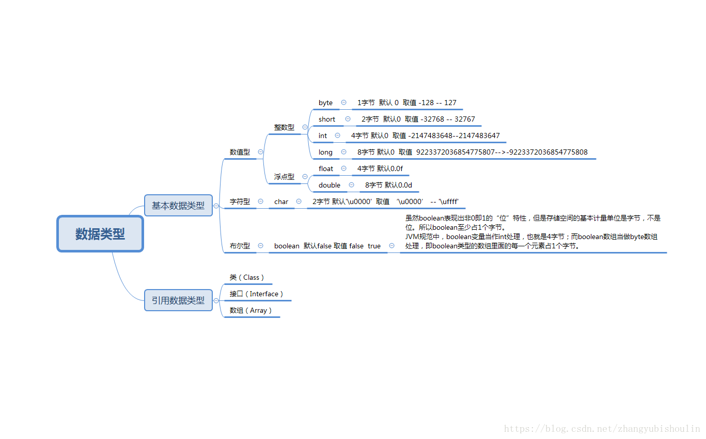

# BASIC QUESTIONS

> HashMap的源码，实现原理，JDK8中对HashMap做了怎样的优化

a
> HaspMap扩容是怎样扩容的，为什么都是2的N次幂的大小

为了保证hash散列平稳
> HashMap，HashTable，ConcurrentHashMap的区别

a
> 极高并发下HashTable和ConcurrentHashMap哪个性能更好，为什么，如何实现的

a
> HashMap在高并发下如果没有处理线程安全会有怎样的安全隐患，具体表现是什么

a
> java中四种修饰符的限制范围

- private 私有
- 无修饰符 本类 + 本包
- protected 本类 + 子类
- public 都可以访问

> Object类中的方法

``` java
private static native void registerNatives();
public final native Class<?> getClass();
public native int hashCode();
public boolean equals(Object obj) {
    return (this == obj);
}
protected native Object clone() throws CloneNotSupportedException;
public String toString() {
    return getClass().getName() + "@" + Integer.toHexString(hashCode());
}
public final native void notify();
public final native void notifyAll();
public final native void wait(long timeout) throws InterruptedException;
public final void wait(long timeout, int nanos) throws InterruptedException {
     if (timeout < 0) {
        throw new IllegalArgumentException("timeout value is negative");
    }

    if (nanos < 0 || nanos > 999999) {
          throw new IllegalArgumentException(
                              "nanosecond timeout value out of range");
    }

    if (nanos > 0) {
        timeout++;
    }

    wait(timeout);
}
public final void wait() throws InterruptedException {
    wait(0);
}
protected void finalize() throws Throwable { }
```

> 接口和抽象类的区别，注意JDK8的接口可以有实现

a
> 动态代理的两种方式，以及区别

a
> Java序列化的方式

a
> 传值和传引用的区别，Java是怎么样的，有没有传值引用

a
> 一个ArrayList在循环过程中删除，会不会出问题，为什么

会出现ConcureentModificationException, 需要用iterator来实现遍历删除
> @Transactional注解在什么情况下会失效，为什么

1. @Transactional 应用在非 public 修饰的方法上
2. @Transactional 注解属性 propagation 设置错误
3. @Transactional 注解属性 rollbackFor 设置错误
4. 同一个类中方法调用，导致@Transactional失效
5. 异常被你的 catch“吃了”导致@Transactional失效
6. 数据库引擎不支持事务

> java反射中，Class.forName和classloader的区别?

- class.forName()和classLoader都可用来对类进行加载。  
- class.forName()除了将类的.class文件加载到jvm中之外，还会对类进行解释，执行类中的static块。
- 而classLoader只干一件事情，就是将.class文件加载到jvm中，不会执行static中的内容,只有在newInstance才会去执行static块。
- Class.forName(name, initialize, loader)带参函数也可控制是否加载static块。并且只有调用了newInstance()方法采用调用构造函数，创建类的对象

```java
 public static Class<?> forName(String className) throws ClassNotFoundException {
    Class<?> caller = Reflection.getCallerClass();
    return forName0(className, true, ClassLoader.getClassLoader(caller), caller);
}
```

> Spring事务

- PROPAGATION_REQUIRED: 表示当前方法必须运行在事务中。如果当前事务存在，方法将会在该事务中运行。否则，会启动一个新的事务
- PROPAGATION_SUPPORTS: 表示当前方法不需要事务上下文，但是如果存在当前事务的话，那么该方法会在这个事务中运行
- PROPAGATION_MANDATORY: 表示该方法必须在事务中运行，如果当前事务不存在，则会抛出一个异常
- PROPAGATION_REQUIRED_NEW: 表示当前方法必须运行在它自己的事务中。一个新的事务将被启动。如果存在当前事务，在该方法执行期间，当前事务会被挂起。如果使用JTATransactionManager的话，则需要访问TransactionManager
- PROPAGATION_NOT_SUPPORTED: 表示该方法不应该运行在事务中。如果存在当前事务，在该方法运行期间，当前事务将被挂起。如果使用JTATransactionManager的话，则需要访问TransactionManager
- PROPAGATION_NEVER: 表示当前方法不应该运行在事务上下文中。如果当前正有一个事务在运行，则会抛出异常
- PROPAGATION_NESTED: 表示如果当前已经存在一个事务，那么该方法将会在嵌套事务中运行。嵌套的事务可以独立于当前事务进行单独地提交或回滚。如果当前事务不存在，那么其行为与PROPAGATION_REQUIRED一样。

> OOM问题和StackOverflow有什么区别

- 如果线程请求的栈深度大于虚拟机所允许的最大深度，会抛出StackOverFlow内存溢出异常。
- 如果虚拟机在拓展栈时无法申请到足够的内存空间，则会抛出OOM泄露异常。

> Java中的几种基本数据类型是什么? 各占用多少字节?



> String类可以被继承吗? 为什么

不可以, String类是被final关键字修饰的类, 无法被继承

1. 修饰类: 当用final修饰一个类时，表明这个类不能被继承。final类中的成员变量可以根据需要设为final，但是要注意final类中的所有成员方法都会被隐式地指定为final方法。
2. 修饰方法: 使用final修饰方法的原因有两个。第一个原因是把方法锁定，以防任何继承类修改它的含义；第二个原因是效率。在早期的Java实现版本中，会将final方法转为内嵌调用。但是如果方法过于庞大，可能看不到内嵌调用带来的任何性能提升。在最近的Java版本中，不需要使用final方法进行这些优化了。
3. 修饰变量: 对于被final修饰的变量，如果是基本数据类型的变量，则其数值一旦在初始化之后便不能更改；如果是引用类型的变量，则在对其初始化之后便不能再让其指向另一个对象。虽然不能再指向其他对象，但是它指向的对象的内容是可变的。

> String, StringBuffer和StringBuilder的区别

运算速度比较（通常情况下）：StringBuilder > StringBuffer > String

String：适用于少量的字符串操作。

StringBuilder：适用于单线程下在字符串缓冲区进行大量操作。

StringBuffer：适用于多线程下在字符串缓冲区进行大量操作。

> ArrayList和LinkedList有什么区别?

1. ArrayList是实现了基于动态数组的数据结构，LinkedList基于链表的数据结构。
2. 对于随机访问get和set，ArrayList绝对优于LinkedList，因为LinkedList要移动指针。
3. 对于新增和删除操作add和remove，LinedList比较占优势，因为ArrayList要移动数据。

> 类的实例化顺序: 父类静态数据, 构造函数, 字段, 子类静态数据, 构造函数, 字段, 当new的时候, 他们的执行顺序?

1. 首先会执行类中static代码块(不管代码块是否在类的开头还是末尾处)，如果这个类有父类，同样会优先查找父类中的static代码块，然后是当前类的static。
2. 然后会从父类的第一行开始执行，直至代码末尾处，中间不管是有赋值还是method调用，都会按顺序一一执行（method），普通代码块{ }...
3. 其次才是父类的构造函数，执行带参数或不带参数的构造函数，依赖于实例化的类的构造函数有没有super父类的带参或不带参的构造函数，上边试验二三已经证明。
4. 然后会从子类（当前类）的第一行开始执行，直至代码末尾处，中间不管是有赋值还是method调用，都会按顺序一一执行（method），普通代码块{ }...
5. 其次会是子类（当前类）的构造函数，按顺序执行。
6. 最后是类方法的调用执行，如果子类覆盖了父类的method，执行时会先执行子类覆盖的method，method内如果有super.method()，才会调用父类的同名method，否则不会。

总结：父类静态成员和静态代码块->子类静态成员和静态代码块->父类非静态成员和非静态代码块->父类构造方法->子类非静态成员和非静态代码块->子类构造方法

> 用过哪些Map类, 都有什么区别? HashMap是线程安全的吗?并发下使用的map是什么? 内部原理分别是什么? (存储方式, hashcode, 扩容, 默认容量等)

HashMap, LinkedHashMap, ConcurrentHashMap, TreeMap  
HashMap是非线程安全的, 并发场景下用ConcurrentHashMap

> JDK1.8的ConcurrentHashMap放弃了分段锁, 为什么? 如果你来设计, 你如何设计?

在JAVA的jdk1.8中则对ConcurrentHashMap又再次进行了大的修改，取消了segment段锁字段，采用了CAS+Synchronize技术来保障线程安全。
