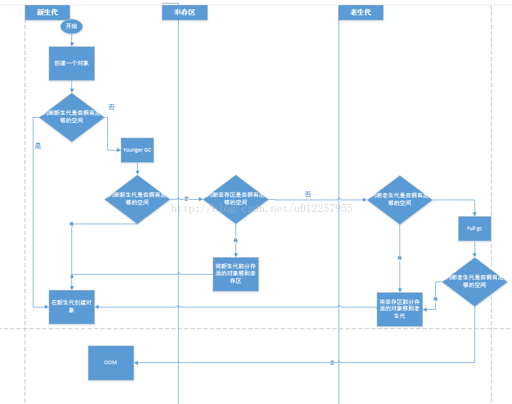

# JVM & JMM

> JVM的内存结构

a
> JVM方法栈的工作过程，方法栈和本地方法栈有什么区别

a
> JVM的栈中引用如何和堆中的对象产生关联

a
> 逃逸分析技术

a
> GC的常见算法，CMS以及G1的垃圾回收过程，CMS的各个阶段哪两个是Stop the world的，CMS会不会产生碎片，G1的优势

a
> 标记清除和标记整理算法的理解以及优缺点

a
> eden survivor区的比例，为什么是这个比例，eden survivor的工作过程

a
> JVM如何判断一个对象是否该被GC，可以视为root的都有哪几种类型

a
> 强软弱虚引用的区别以及GC对他们执行怎样的操作

a
> Java是否可以GC直接内存

a
> Java类加载的过程

a
> 双亲委派模型的过程以及优势

a
> 常用的JVM调优参数

a
> dump文件的分析

a
> Java有没有主动触发GC的方式

System.gc()
> 说说对synchronized关键字的理解

synchronized关键字解决的是多个线程之间访问资源的同步性，synchronized关键字可以保证被它修饰的方法或者代码块在任意时刻只能有一个线程执行。

在 Java 早期版本中，synchronized属于重量级锁，效率低下，因为监视器锁（monitor）是依赖于底层的操作系统的 Mutex Lock 来实现的，Java 的线程是映射到操作系统的原生线程之上的。如果要挂起或者唤醒一个线程，都需要操作系统帮忙完成，而操作系统实现线程之间的切换时需要从用户态转换到内核态，这个状态之间的转换需要相对比较长的时间，时间成本相对较高，这也是为什么早期的 synchronized 效率低的原因。庆幸的是在 Java 6 之后 Java 官方对从 JVM 层面对synchronized 较大优化，所以现在的 synchronized 锁效率也优化得很不错了。JDK1.6对锁的实现引入了大量的优化，如自旋锁、适应性自旋锁、锁消除、锁粗化、偏向锁、轻量级锁等技术来减少锁操作的开销。

> 如何使用 synchronized 关键字

- 修饰实例方法: 作用于当前对象实例加锁，进入同步代码前要获得当前对象实例的锁
- 修饰静态方法: 也就是给当前类加锁，会作用于类的所有对象实例，因为静态成员不属于任何一个实例对象，是类成员 (static 表明这是该类的一个静态资源，不管new了多少个对象，只有一份) 所以如果一个线程A调用一个实- 例对象的非静态 synchronized 方法，而线程B需要调用这个实例对象所属类的静态 synchronized 方法，是允许的，不会发生互斥现象，因为访问静态 synchronized 方法占用的锁是当前类的锁，而访问非静态 synchronized 方法占用的锁是当前实例对象锁。
修饰代码块: 指定加锁对象，对给定对象加锁，进入同步代码库前要获得给定对象的锁。

> 什么情况下会发生栈内存溢出?

1. 方法创建了很大的对象, List | Array
2. 循环调用, 死循环
3. 引用了较大的全局变量

- StackOverFlowError
  - 栈溢出就是方法执行是创建的栈帧超过了栈的深度。那么最有可能的就是方法递归调用产生这种结果 (-Xss)
- OutOfMemoryError(java heap space)
  - heap space表示堆空间，堆中主要存储的是对象。如果不断的new对象则会导致堆中的空间溢出 (-Xmx)
- OutOfMemoryError(PermGen space)
  - JDK1.8移除永久代，所以上述代码在JDK1.7及之前会出现永久代溢出的现象

> Java的内存结构, eden和survivor的比例

- 两种类型
  1. 线程安全：虚拟机栈、本地方法栈、程序计数器
  2. 非线程安全：堆，方法区

- 虚拟机栈：每个方法被执行时，都会在内存中创建一个空间用来存储方法中的局部变量，方法的出入口等信息
- 本地方法栈：每个本地方法被执行时，都会创建一个内存空间，用来存储本地方法中的局部变量，方法的出入口等信息
- 程序计数器：是当前程序所执行的class文件的行号指示器，通过改变行号来决定下一段要执行的字节码指令，跳转，循环，异常处理
- 堆：每一个对象的创建跟分配都是在堆上面进行的，堆分为新生代，老生代。新生代有一个Eden和两个Survivor组成，默认比例是8：2,也可以使用-XXSurvivorRatio来改变百分比
- 方法区：用来存放类的版本，类的方法还有static修饰的对象等信息

> JVM内存模型为什么要分成新生代, 老年代, 持久代. 新生代中为什么要分Eden和Survivor

1. Minor GC是发生在新生代中的垃圾收集，采用的复制算法
2. 新生代中每次使用的空间不超过90%，主要用来存放新生的对象
3. Minor GC每次收集后Eden区和一块Survivor区都被清空
4. 老年代中使用Full GC，采用的标记-清除算法

- 类需要同时满足下面3个条件才能算是“无用的类”
  1. 该类所有的实例都已经被回收，也就是Java堆中不存在该类的任何实例
  2. 加载该类的ClassLoader已经被回收
  3. 该类对应的java.lang.Class对象没有在任何地方被引用，无法在任何地方通过反射访问该类的方法

> JVM中一次完整的GC流程是怎样的, 对象如何晋升到老年代, 说说你知道的几种主要的JVM参数

- 对象晋升到老年代一共有三种可能:
  1. 当对象达到成年, 经历过15次GC(默认值), 就晋升到老年代
  2. 大的对象直接在老年代创建
  3. eden和survivor区内存不足时, 对象可能晋升到老年代

1. -Xms设置堆的最小空间大小。
2. -Xmx设置堆的最大空间大小。
3. -XX:NewSize设置新生代最小空间大小。
4. -XX:MaxNewSize设置新生代最大空间大小。
5. -XX:PermSize设置永久代最小空间大小。
6. -XX:MaxPermSize设置永久代最大空间大小。
7. -Xss设置每个线程的堆栈大小。

> 你知道哪几种垃圾收集器, 各自的优缺点(重点讲下cms, G1, 包括原理, 流程, 优缺点)

- 串行垃圾收集器: 收集时间长，停顿时间久(stop the world)
- 并发垃圾收集器: 碎片空间多
- CMS: 并发标记清除, 主要步骤有: 初始收集，并发标记，重新标记，并发清除（删除），重置
- G1: 主要步骤: 初始标记，并发标记，重新标记，复制清除（整理）
- CMS的缺点是对cpu的要求比较高。G1是将内存化成了多块，所以对内段的大小有很大的要求
- CMS是清除，所以会存在很多的内存碎片。G1是整理，所以碎片空间较小

> 垃圾回收算法的实现原理

常用的垃圾回收算法有两种: 引用计数和可达性分析

- 引用计数是增加一个字段来标识当前的引用次数，引用计数为0的就是可以GC的。但是引用计数不能解决循环引用的问题
- 可达性分析：就是通过一系列GC ROOT的对象作为起点，向下搜索，搜索所有没有与当前对象GC ROOT 有引用关系的对象。这些对象就是可以GC的。

> 当出现了内存溢出, 怎么排错

1. 首先控制台查看错误日志
2. 然后使用jdk自带的jvisualvm工具查看系统的堆栈日志
3. 定位出内存溢出的空间：堆，栈还是永久代（jdk8以后不会出现永久代的内存溢出）
4. 如果是堆内存溢出，看是否创建了超大的对象
5. 如果是栈内存溢出，看是否创建了超大的对象，或者产生了死循环

> JVM内存模型的相关知识了解多少(重排序, 内存屏障, happen-before, 主内存, 工作内存)

- 重排序：jvm虚拟机允许在不影响代码最终结果的情况下，可以乱序执行
- 内存屏障：可以阻挡编译器的优化，也可以阻挡处理器的优化(volatile)
- happens-before原则：
  1. 一个线程的A操作总是在B之前，那多线程的A操作肯定在B之前。
  2. monitor在加锁的情况下，持有锁的肯定先执行。
  3. volatile修饰的情况下，写先于读发生
  4. 线程启动在一起之前 start
  5. 线程死亡在一切之后 end
  6. 线程操作在一切线程中断之前
  7. 一个对象构造函数的结束都该对象的finalizer的开始之前
  8. 传递性，如果A肯定在B之前，B肯定在C之前，那A肯定是在C之前。
- 主内存：所有线程共享的内存空间
- 工作内存：每个线程特有的内存空间

> 简单说说你了解的类加载器, 可以打破双亲委派么, 如何打破?

类加载器主要分为：引导类加载器（Bootstrap ClassLoader）、扩展类加载器（Extension ClassLoader），系统类加载器（App ClassLoader）和自定义加载器（Custom ClassLoader）

双亲委派：**双亲委派模式会保证父类加载器先加载类**

---

自定义类加载器，重写loadClass方法; 使用线程上下文类加载器.(tomcat)

第一次：在双亲委派模型出现之前—–即JDK1.2发布之前。  
第二次：是这个模型自身的缺陷导致的。我们说，双亲委派模型很好的解决了各个类加载器的基础类的统一问题（越基础的类由越上层的加载器进行加载），基础类之所以称为“基础”，是因为它们总是作为被用户代码调用的API， 但没有绝对，如果基础类调用会用户的代码怎么办呢？

这不是没有可能的。一个典型的例子就是JNDI服务，JNDI现在已经是Java的标准服务，它的代码由启动类加载器去加载（在JDK1.3时就放进去的rt.jar）,但它需要调用由独立厂商实现并部署在应用程序的ClassPath下的JNDI接口提供者（SPI， Service Provider Interface）的代码，但启动类加载器不可能“认识“这些代码啊。因为这些类不在rt.jar中，但是启动类加载器又需要加载。怎么办呢？

为了解决这个问题，Java设计团队只好引入了一个不太优雅的设计：线程上下文类加载器（Thread Context ClassLoader）。这个类加载器可以通过java.lang.Thread类的setContextClassLoader方法进行设置。如果创建线程时还未设置，它将会从父线程中继承一个，如果在应用程序的全局范围内都没有设置过多的话，那这个类加载器默认即使应用程序类加载器。

有了线程上下文加载器，JNDI服务使用这个线程上下文加载器去加载所需要的SPI代码，也就是父类加载器请求子类加载器去完成类加载的动作，这种行为实际上就是打通了双亲委派模型的层次结构来逆向使用类加载器，实际上已经违背了双亲委派模型的一般性原则。但这无可奈何，Java中所有涉及SPI的加载动作基本胜都采用这种方式。例如JNDI，JDBC，JCE，JAXB，JBI等。

第三次：为了实现热插拔，热部署，模块化，意思是添加一个功能或减去一个功能不用重启，只需要把这模块连同类加载器一起换掉就实现了代码的热替换。
> 讲讲Java反射机制

在运行时, 对于任意一个类，都能知道当前类的方法和属性，对于任意一个类，都能调用类的方法和属性，动态加载机制就是Java的反射机制。

> 线上运用的JVM参数有哪些

-XX:PermSize=128M  
-XX:MaxPermSize=512m  
-XX:PermSize=128M  
-XX:MaxPermSize=512m  
-Xms512m  
-Xmx1024m  
-XX:PermSize=640m  
-XX:MaxPermSize=1280m  
-XX:NewSize=64m  
-XX:MaxNewSize=256m  
-verbose:gc  
-XX:+PrintGCDetails  
-XX:+PrintGCTimeStamps  

> G1和CMS的区别, 吞吐量优先和响应优先的垃圾收集器选择

CMS:并发标记清除。他的主要步骤有：初始收集，并发标记，重新标记，并发清除（删除），重置  
G1：主要步骤：初始标记，并发标记，重新标记，复制清除（整理）  

CMS的缺点是对cpu的要求比较高。G1是将内存化成了多块，所有对内段的大小有很大的要求  
CMS是清除，所以会存在很多的内存碎片。G1是整理，所以碎片空间较小

吞吐量优先：G1

响应优先：CMS
> 怎么打出线程栈信息

`Thread.getStackTrace()`

---
-server：服务器模式  
-Xms512m ：初始堆空间  
-Xmx512m：最大堆空间  
-Xss1024K ：栈空间  
-XX:PermSize=256m ：初始永久代空间  
-XX:MaxPermSize=512m ：最大永久代空间  
-XX:MaxTenuringThreshold=20 ：对象的生命周期  
XX:CMSInitiatingOccupancyFraction=80 ：老年代的内存在使用到70%的时候，就开始启动CMS了  
-XX:+UseCMSInitiatingOccupancyOnly：它就只会按照你设置的比率来启动CMS GC了
