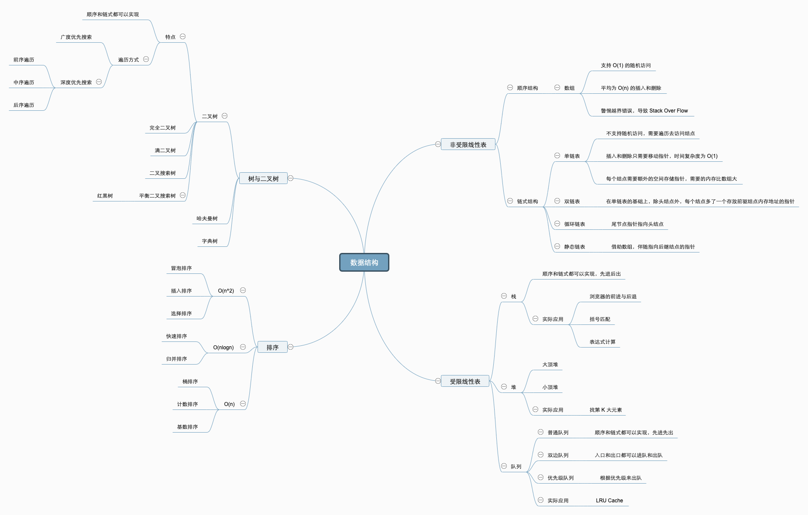
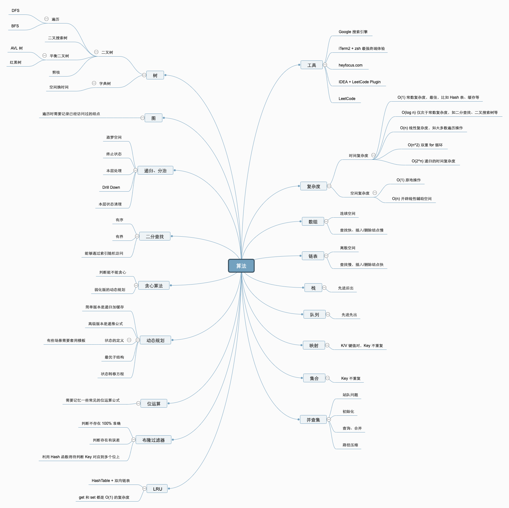

# 算法

## 数据结构与算法总览





### 精通一个领域 (semantic tree)

- chunk it up (chapter, part)
- deliberately practicing (练五遍)
- feedback (crack questions)

### 1.数据结构

- 一维数据结构
  - 基础: Array, LinkedList
  - 高级: Stack, Queue, Dequeue, Set, Map
- 二维数据结构
  - 基础: Tree, Graph
  - 高级: binary search tree(red-black, AVL), heap, disjoint set, Trie 字典树
- 特殊数据结构
  - 位运算Bitwise, 步隆过滤器(Bloom Filter)
  - LRU Cache

### 2.算法

- if-else, switch -- branch
- for,while loop -- iteration
- 递归Recursion(Divide & Conquer, Backtrace)

---

- Search: 深度优先搜索 Depth First Search, 广度优先搜索 Breadth First Search, A*, etc
- 动态规划 Dynamic Programming
- 二分查找 Binary Search
- 贪心 Greedy
- 数学 Math, 几何 Geometry

### 3.切题四件套

- Clarification
- Possible Solutions
  - compare (time/space)
  - optimal (enhance)
- Coding
- Test cases

### 其他建议

- 善用Google
- Iterm2 & zsh
- Vscode + leetcode plugin
- IDE的快捷方式 熟练
- 自顶向下的编程方式

## 复杂度分析

### 空间复杂度

### 时间复杂度

O(1): Constant Complexity 常数复杂度

```java
int n = 100;
pring("your input is " + n);
```

O(log n): Logaithmic Complexity 对数复杂度

```java
for (int i = 1; i <= n; i= i*2) {
    System.out.println("your input is: " + i)
}
```

O(n): Linear Complexity 线性时间复杂度

```java
for (int i =1; i<= n; i++) {
    System.out.println("your input is: " + i);
}
```

O(n^2): 2 square Complexity 平方

```java
for (int i =1; i<= n; i++) {
    for (int j = 1; j <=n; j++) {
        System.out.println("your input is: " + i +j);
    }
}
```

O(n^3): 3 square Complexity 立方

```java
for (int i =1; i<= n; i++) {
    for (int j = 1; j <=n; j++) {
        for (int a = 1; a <=n; a++) {
            System.out.println("your input is: " + i+j+a);
        }
    }
}
```

O(2^n): Exponential Growth 指数 (递归)

```java
int fib(int n) {
  if (n <= 2) return n;
  return fib(n-1) + fib(n-2);
}
```

O(n!): Factorial 阶乘

### 递归

画出递归树 (找出重复部分 -> 做缓存)

### 主定理


## 数组, 链表, 跳表

升维 -- 空间换时间

- array
  - prepend O(1)
  - append O(1)
  - lookup O(1)
  - insert O(n)
  - delete O(n)
- linkedlist
  - prepend O(1)
  - append O(1)
  - lookup O(n)
  - insert O(1)
  - delete O(1)
- 跳表 (skip list)
  - lookup O(logn)
  - insert O(logn)
  
### 1.实战解析: 移动零

1. 5-10分钟: 读题和思考
2. 有思路: 自己开始做和写代码; 不然, 马上看题解
3. 默写背诵, 熟练

## 栈和队列

- Stack (FILO); 添加, 删除皆为 O(1), 查询O(n)
- Queue (FIFO); 添加, 删除皆为 O(1), 查询O(n)
- Deque 添加, 删除皆为 O(1), 查询O(n)

### Stack

```java
Stack<Integer> stack = new Stack<>();
stack.push(1);
stack.push(2);
stack.search(1);
stack.pop();
stack.peek();
```

### Queue

```java
Queue<String> queue = new LinkedList<>();
queue.size();
queue.add("1");
queue.offer("one");
queue.remove();
queue.poll();
queue.element();
queue.peek();
```

### Deque

```java
Deque<Integer> deque = new LinkedList<>();
    deque.addFirst(1);
    deque.addLast(2);
    System.out.println(deque);

    int a = deque.getFirst();
    int b = deque.peekLast();

    while (deque.size() > 0) {
         System.out.println(deque.pollLast());
    }
```

### PriorityQueue

1. 插入操作: O(1)
2. 取出操作: O(logN) -- 按照元素的优先级取出
3. 底层具体实现的数据结构较为多样和复杂: heap, BST, treap

## 哈希表 映射 集合

哈希表(Hash Table), 也叫散列表, 根据关键码值(Key value)而直接进行访问的数据结构  
映射函数叫散列函数(Hash Function), 存放记录的数组叫做哈希表

## Tree

### Binary Tree

LinkedList是特殊化的Tree  
Tree是特殊化的Graph

### 二叉树遍历

1. 前序（PreOrder）： 根左右
2. 中序（InOrder): 左根右
3. 后序（PostOrder）： 左右根

### 二叉搜索树（BST）

二叉搜索树, 也称有序二叉树, 排序二叉树, 是指一颗空树或者具有下列性质的二叉树:

- 左子树上所有节点的值均小于它的根节点的值
- 右子树上所有节点的值均大于它的根节点的值
- 以此类推: 左, 右子树也分别为二叉查找树.

中序遍历： 升序遍历

---

1. 查询
2. 插入新节点
3. 删除

### 相关面试题

- binary-tree-inorder-traversal
- binary-tree-preorder-traversal
- n-ary-tree-postorder-traversal
- n-ary-tree-preorder-traversal
- n-ary-tree-level-order-traversal

### python代码模板

```python
def recursion(level, param1, param2,...):
    # recursion terminator (跳出递归)
    if level > MAX_LEVEL:
        process_result
        return
    # process logic in current level (处理当前层逻辑)
    process(level, data...)

    # drill down (到下一层)
    self.recursion(level+1, param1,...)

    # reverse the current level status if needed (清理当前层)
```

### 思维要点

1. 不要人肉进行递归 (误区)
2. 找到最近最简方法, 将其拆解成可重复解决的问题(重复子问题)
3. 数学归纳法思维

### 递归题目

- 70.climb statirs
- 22.generate parenthesis
- invert-binary-tree
- validate-binary-search-tree
- maximum-depth-of-binary-tree
- minimum-depth-of-binary-tree
- serialize-and-deserialize-binary-tree

### 递归作业

- lowest-common-ancestor-of-a-binary-tree
- construct-binary-tree-from-preorder-and-inorder-traversal
- combinations
- permutations
- permutations-II

## 分治, 回溯

```python
def divide_conquer(problem, param1, param2...):
    # recursion terminator
    if problem is None:
        print_resule
        return
    # prepare data
    data = prepare_data(problem)
    sub_problems = split_problem(problem, data)

    # conquer sub problems
    sub_result1 = self.divide_conquer(sub_problems[0], p1, ...)
    sub_result2 = self.divide_conquer(sub_problems[1], p1, ...)
    sub_result3 = self.divide_conquer(sub_problems[2], p1, ...)

    # process and generate the final result
    result = process_result(sub_result1, sub_result2, ...)

    # revert the current level states
```

- powx-n
- subsets
- majority-element
- letter-combinations-of-a-phone-number
- n-queens

## 深度优先搜索/广度优先搜索

- 每个节点都要访问一次
- 每个节点仅仅访问一次

深度优先搜索

```python
def dfs(node: TreeNode):
    if node in visited:
        # already visited
        return
    visited.add(node)

    # process current node
    process(node)
    dfs(node.left)
    dfs(node.right)

visited = set()
def dfs(node, visited):.
    if node in visited:
        # already visited
        return
    visited.add(node)
    for next_node in node.children():
        if not next_node in visited:
            dfs(next_node, visited)
```

广度优先搜索

```py
def BFS(graph, start, end):
    queue = []
    queue.append(start)
    visited.add(start)

    while queue:
        node = queue.pop()
        visited.add(node)
        process(node)
        nodes = generate_related_nodes(node)
        queue.push(nodes)
    # other processes
```

### dfs/bfs题目

- binary-tree-level-order-traversal
- minimun-genetic-mutation
- generate-parentheses
- find-largest-value-in-each-tree-row

---

- word-ladder
- word-ladder-II
- number-of-islands
- minesweeper

## 贪心Greedy

贪心算法是一种在每一步选择中都采取在当前状态下最好或最优的选择, 从而希望结果是全局最好或最优的算法

- 贪心: 当下做局部最优判断
- 回溯: 能够回退
- 动态规划: 最优判断 + 回退

---

贪心法可以解决一些最优化问题: 求图中的最小生成树, 求哈夫曼编码等

### 贪心相关题目

- coin change
- lemonade-change
- best-time-to-buy-and-sell-stock-II
- assign-cookies
- walking-robot-simulation
- jump-game
- jump-game-II

## 二分查找

### 二分查找的前提

1. 目标函数单调性 (单调递增或者递减)
2. 存在上下界 (Bounded)
3. 能够通过索引访问 (index accessible)

```py
left, right = 0, len(arr)-1
while left <= right:
    mid - (left+right) / 2
    if arr[mid] == target:
        return result
    elif arr[mid] < target:
        left = mid+1
    else:
        right = mid-1
```

### 二分查找相关

- sqrtx
- valid-perfect-square
- search-in-rotated-sorted-array
- search-a-2d-matrix
- find-minimum-in-rotated-sorted-array

## 动态规划

1. 动态规划和递归或者分治没有根本上的区别
2. 共性: 找到重复子问题
3. 差异性: 最优子结构, 中途可以淘汰次优解

---

1. 最优子结构 dp[n] = best_of(dp[n-1], dp[n-2])
2. 储存中间状态: dp[i]
3. 递推公式

Fib: dp[n] = dp[n-1] + dp[n-2]

二维路径: dp[i,j] = dp[i+1,j] + dp[i,j+1]

```py
opt[i,j] = opt[i+1,j] + opt[i,j+1]
if a[i,j] = '0':
    opt[i,j] = opt[i+1,j] + opt[i,j+1]
else:
    opt[i,j] = 0
```

1. 打破自己的思维惯性, 形成机器思维
2. 理解复杂逻辑的关键
3. 职业进阶的要点要领

### dp面试题

1. Fibonacci
2. count the paths
3. unique path
4. longest common subsequence
5. climbing-stairs
6. triangle
7. maximum-subarray
8. maximum-product-subarray
9. coin-change
10. house-robber
11. house-robber-ii
12. best-time-to-buy-and-sell-stock (series)
13. edit-distance

## 字典树和并查集

### 字典树的数据结构

字典树, Trie数, 又称单词查找树或键树, 是一种树形结构. 典型应用是用于统计和排序大量的字符串, 所以经常被搜索引擎系统用于文本词频统计

优点: 最大限度地减少无谓的字符串比较, 查询效率比哈希表高.

### 字典树的核心思想

- Trie树的核心思想是空间换时间
- 利用字符串的公共前缀来降低查询时间的开销以达到提高效率的目的

### 字典树的基本性质

1. 节点本身不存完整单词
2. 从根节点到某一节点, 路径上经过的字符连接起来, 为该节点对应的字符串
3. 每个节点的所有字节点路径代表的字符都不相同

### 字典树 - 例题

- friend-circles
- number-of-islands
- surrounded-regions
- implement-trie-prefix-tree
- word-search-ii

### 并查集

#### 基本操作

1. makeSet(s): 建立一个新的并查集, 其中包含s个单元素集合
2. unionSet(x,y): 把元素x和元素y所在的集合合并, 要求x和y所在的集合不相交, 如果相交则不合并
3. find(x): 找到元素x所在的集合的代表, 该操作也可以用于判断两个元素是否位于同一个集合, 比较它们各自的代表

## Learn from Labuladong

### 动态规划详解

- 动态规划问题的一般形式就是求最值
- 求解动态规划的核心问题是穷举
  - 重叠子问题
  - 最优子结构
  - 状态转移方程
