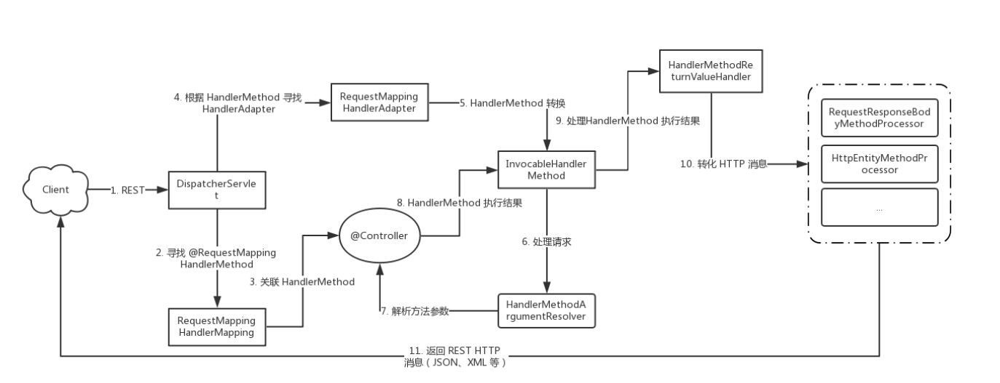
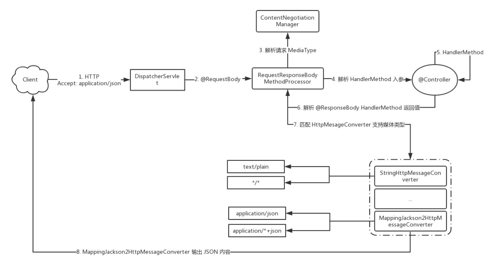

# SpringBoot 2.0

## 第一章 系列总览

### 1.要点

- 组件自动装配: 模式注解, @Enable 模块, 条件装配, 加载机制
- 外部化配置: Environment 抽象, 生命周期, 破坏性变更
- 嵌入式容器: Servlet 容器, Reactive Web 容器
- SpringBootStarter: 依赖管理, 装配条件, 装配顺序

### 2.核心特性

- 自动装配: Web MVC, Web Flux, JDBC 等
- 嵌入式容器: Tomcat, Jetty, Undertow
- 生产准备特性: 指标, 健康检查, 外部化配置等

#### 自动装配(auto configure)

1. 激活: @EnableAutoConfiguration
2. 配置: /META-INF/spring.factories
3. 实现: xxAutoConfiguration

#### 嵌入式容器

1. tomcat
2. netty

#### 生产准备特性

1. 指标: /actuator/metrics
2. 健康检查: /actuator/health
3. 外部化配置: /actuator/configprops

### 3.传统 Servlet 应用

- Servlet
  - 实现
    - @WebServlet
    - `extends HttpServlet`
    - doGet/doPost
  - URL 映射
    - @WebServlet(urlPattern="/")
  - 注册
    - @ServletComponentScan(basePackage="xxx/xxx")
- Filter
- Listener

### 4. 异步非阻塞

```java
@WebServlet(urlPattern="/", asyncSupported=true)

AsyncContext asyncContext = req.startAsync()
asyncContext.start(() -> {})
// trigger complete
asyncContext.complete();
```

### 5.Spring MVC

- 视图; 模版引擎, 内容协商, 异常处理
- REST: 资源服务, 资源跨域, 服务发现
- Core: 核心架构, 处理流程, 核心组件

### 6.Spring Web Flux

- Reactor 基础: Java Lambda, Mono, Flux
- 核心: Web MVC 注解, 函数式声明, 异步非阻塞

### 7.WebServer

tomcat, jetty, undertow, webflux

### 8.Data

- jdbc: datasource, JdbcTemplate, autoconfigure
- JPA: 实体映射关系, 实体操作, 自动装配
- 事务: Spring 事务抽象, JDBC 事务处理, 自动装配

### 9.事务拓展

- SpringApplication: 失败分析, 应用特性, 事件监听等
- SpringBoot 配置: 外部化配置, profile, 配置属性
- starter 开发, 最佳实践

### 10.运维管理

- 端点: 各类 Web 和 JMX Endpoints
- 健康检查: Health, HealthIndicator
- 指标: 内建 Metrics, 自定义 Metrics

## 第二章 自动装配

### 1.手动装配

- 定义: 一种用于声明在应用中扮演”组件“角色的注解
- 例: @Component, @Service, @Configuraton
- 装配: <context:component-scan> 或 @ComponentScan

### 2.@Enable 模块装配

- 定义: 具备相同领域的功能组件集合, 组合所形成一个独立的单元
- 举例: @EnableWebMvc, @EnableAutoConfiguration
- 实现: 注解方式, 编程方式

### 3.条件装配

- 定义: Bean 装配的前置判断
- 举例: @Profile, @Conditional
- 实现: 注解方式, 编程方式

### 4.自动装配

- 定义: 约定大于配置的原则, 实现 Spring 组件自动装配的目的
- 装配: 模式注解, @Enable 模块, 条件装配, 工厂加载机制
- 实现: 激活自动装配, 实现自动装配, 配置自动装配实现

## 第三章 SpringApplication

### 1. What is SpringApplication

- Spring 模式注解
- Spring 应用上下文
- Spring 工厂加载机制
- Spring 应用上下文初始器
- Spring Environment 抽象
- Spring 应用事件/监听器

### 2.Spring Application

- SpringApplication
- SpringApplicationBuilder API
- SpringApplication Running Listener
- SpringApplication args
- SpringApplication 故障分析
- SpringBoot 应用事件/监听器

### 3.准备阶段

- 定义: Spring 应用引导类, 提供遍历的自定义行为方法
- 场景: 嵌入式 Web 应用和非 Web 应用
- 应用: SpringApplication#run(args...)

### 4.spring 配置 Bean

```java
 public static void main(String[] args) {
        SpringApplication springApplication = new SpringApplication();

        // source ->className, packageName,  xml location
        springApplication.setSources(Collections.singleton(Con.class.getName()));
        ConfigurableApplicationContext configurableApplicationContext = springApplication.run(args);
        configurableApplicationContext.getBean(Con.class.getName());
    }

    @SpringBootApplication
    public static class Con {}
```

### 5. 推断 Web 应用类型

```java
static WebApplicationType deduceFromApplicationContext(Class<?> applicationContextClass) {
    if (isAssignable(SERVLET_APPLICATION_CONTEXT_CLASS, applicationContextClass)) {
        return WebApplicationType.SERVLET;
    }
    if (isAssignable(REACTIVE_APPLICATION_CONTEXT_CLASS, applicationContextClass)) {
      return WebApplicationType.REACTIVE;
    }
    return WebApplicationType.NONE;
}
```

### 6. 推断引导类

```java
private Class<?> deduceMainApplicationClass() {
    try {
      StackTraceElement[] stackTrace = new RuntimeException().getStackTrace();
      for (StackTraceElement stackTraceElement : stackTrace) {
          if ("main".equals(stackTraceElement.getMethodName())) {
              return Class.forName(stackTraceElement.getClassName());
          }
      }
  } catch (ClassNotFoundException ex) {
    // Swallow and continue
    }
    return null;
    }
```

### 7. 加载应用上下文初始器 (ApplicationContextInitializer)

```java
private static Map<String, List<String>> loadSpringFactories(@Nullable ClassLoader classLoader) {
    MultiValueMap<String, String> result = cache.get(classLoader);
    if (result != null) {
      return result;
}

    try {
        Enumeration<URL> urls = (classLoader != null ? classLoader.getResources(FACTORIES_RESOURCE_LOCATION) :
        ClassLoader.getSystemResources(FACTORIES_RESOURCE_LOCATION));
        result = new LinkedMultiValueMap<>();
        while (urls.hasMoreElements()) {
            URL url = urls.nextElement();
            UrlResource resource = new UrlResource(url);
            Properties properties = PropertiesLoaderUtils.loadProperties(resource);
            for (Map.Entry<?, ?> entry : properties.entrySet()) {
            String factoryTypeName = ((String) entry.getKey()).trim();
            for (String factoryImplementationName : StringUtils.commaDelimitedListToStringArray((String) entry.getValue())) {
                result.add(factoryTypeName, factoryImplementationName.trim());
        }
        }
        }
            cache.put(classLoader, result);
            return result;
    }
    catch (IOException ex) {
        throw new IllegalArgumentException("Unable to load factories from location [" + FACTORIES_RESOURCE_LOCATION + "]", ex);
        }
    }
```

### 8. 加载应用事件监听器

ApplicationListener & ApplicationEvent

### 9.运行阶段

- 创建: 应用上下文, Environment
- 失败: 故障分析报告
- 回调: CommandLineRunner, ApplicationRunner

监听方法

- starting()
- environmentPrepared(ConfigurableEnvironment)
- contextPrepared(ConfigurableApplicationContext)
- contextLoaded(ConfigurableApplicationContext)
- started(ConfigurableApplicationContext)
- running(ConfigurableApplicationContext)
- failed(ConfigurableApplicationContext,Throwable)

阶段说明

- Spring 应用刚启动
- ConfigurableEnvironment 准备妥当，允许将其调整
- ConfigurableApplicationContext 准备妥当，允许将其调整
- ConfigurableApplicationContext 已装载，但仍未启动
- ConfigurableApplicationContext 已启动，此时 Spring Bean 已初始化完成
- Spring 应用正在运行
- Spring 应用运行失败

Spring Boot 事件

- ApplicationStartingEvent
- ApplicationEnvironmentPreparedEvent
- ApplicationPreparedEvent
- ApplicationStartedEvent
- ApplicationReadyEvent
- ApplicationFailedEvent

---
拓展SpringBoot注意Ordered接口(加载顺序)

## 第四章 Web MVC 核心

- 理解 Spring Web MVC 架构
  - Servlet
    - 请求/响应式
    - 屏蔽网络通讯的细节
    - 面向HTTP协议
    - 完整生命周期
  - 指责
    - 处理请求 (DispatcherServlet)
    - 资源管理 (数据库连接, 消息连接, 其他)
    - 视图渲染 (ViewResolver)

- 认识 Spring Web MVC

- 实现Controller
- 配置WebMVC组件
- 配置DispatcherServlet
- 使用可执行Tomcat Maven插件

```java
@Controller
public class HelloWorldController {
    @RequestMapping("")
    public String index() {
        return "index";
    }
}
```

- 简化 Spring Web MVC

## 第五章 Web MVC 视图应用

### 新一代服务端模板引擎 Thymeleaf

```html
<tr>
<th th:text="#{name}">Name</th>
<th th:text="#{msg}">Msg</th>
</tr>
```

#### 核心要素

- 资源定位: 模板来源
  - 通用资源抽象
    - 文件资源: File
    - ClassPath资源: ClassLoader
    - 统一资源: URL
    - Web资源: ServletContext
  - Spring资源抽象
    - Spring资源: Resource
- 渲染上下文: 变量来源
  - Context: Thymeleaf渲染上下文
  - Model: SpringWebMVC模型
  - Attribute: Servlet上下文
- 模板引擎: 模板渲染
  - ITemplateEngine实现
    - TemplateEngine: Thymeleaf原生实现
    - SpringTemplateEngine: Spring实现
    - SpringWebFluxTemplateEngine: Spring WebFlux实现

```java
    public static void main(String[] args) {
        SpringTemplateEngine templateEngine = new SpringTemplateEngine();
        // 渲染上下文
        Context context = new Context();

        context.setVariable("message", "hello world");

        String result = "<p th:text=\"${message}\"></p>";

        System.out.println(templateEngine.process(result, context));
    }
```

#### 视图处理

- SpringWebMVC视图组件
  - ViewResolver: ThymeleafViewResolver
  - View: ThymeleafView
  - DispatcherServlet
  - ITemplateEngine: SpringTemplateEngine

#### 核心组件

- 视图解析
  - ContentNegotiatingViewResolver
    - InternalResourceViewResolver
    - BeanNameViewResolver
    - ThymeleafViewResolver
- 配置策略
  - 配置Bean: WebMvcConfigurer
  - 配置对象: ContentNegotiationConfigurer
- 策略管理
  - Bean: ContentNegotiationManager
  - FactoryBean: ContentNegotiationManagerFactoryBean
- 策略实现
  - ContentNegotationStrategy
    - 固定`MediaType`: FixedContentNEgotiationStrategy
    - "Accept"请求头: HeaderContentNegotiationStrategy
    - 请求参数: ParameterCOntentNegotiationStrategy
    - 路径拓展名: PathExtensionContentNegotiationStrategy

---

- 理解  BeanNameViewResolver
- 理解HTTP Accept 请求头 与  View Content-Type 匹配
- 理解最佳  View  匹配规则
  - ViewResolver  优先规则
    - 自定义  InternalResourceViewResolver
    - ThymeleafViewResolver
    - 默认  InternalResourceViewResolver
  - MediaType  匹配规则
    - Accept 头策略(Accept:text/html)
    - 请求参数策略(format=text/xml)

## 第六章 Web MVC REST 应用

### REST简介

REST = RESTful = Representational State Transfer，is one way of providing interoperability between computer
systems on the Internet.

#### 架构约束

- 统一接口 (Uniform Interface)
- C/S架构 (Client/Server)
- 无状态 (Stateless)
- 可缓存 (Cacheable)
- 封层系统 (Layered System)
- 按需代码 (Code On Demand)

统一接口(Uniform interface):

- 资源识别(Identification of resources)
  - URI(Uniform Resource Identifier )
- 资源操作(Manipulation of resources through representations)
  - HTTP verbs:GET、PUT、POST、DELETE
- 自描述消息(Self-descriptive messages)
  - Content-Type
  - MIME-Type
  - Media Type: application/javascript、 text/html
- 超媒体(HATEOAS)
  - Hypermedia As The Engine Of Application State

### Web MVC REST支持

- 定义: `@Controller`, `@RestController`
- 映射: `@RequestMapping`, `@*Mapping`
- 请求: `@RequestParam`, `@RequestHeader`, `@CookieValue`, `@RequestBody`, `@PathVariable`, `RequestEntity`
- 相应: `@ResponseBody`, `ResponseEntity`, `ResponseCookie`
- 拦截: `@RestControllerAdvice`, `HandlerInterceptor`
- 跨域: `@CrossOrigin`, `CorsFilter`, `WebMvcConfigurer#addCorsMappings`

### Rest 内容协商

- 内容协商管理器: ContentNegotiationManager
- 媒体类型: MediaType
- 消费媒体类型: @RequestMapping#consumes
- 生产媒体类型: @RequestMapping#produces
- HTTP消息转换器: HttpMessageConverter
- Web MVC 配置器: WebMvcConfigurer
- 处理方法: HandlerMethod
- 处理方法参数解析器: HandlerMethodArgumentResolver
- 处理方法返回值解析器: HandlerMethodReturnValueHandler



---



### CORS

- `@CorssOrigin`
- `WebMvcConfiguer#addCorsMappings`

## 第七章 Servlet

### Servlet简介

核心组件API

- javax.servlet.Servlet - DispatcherServlet
- javax.servlet.Filter - CharacterEncodingFilter
- javax.servlet.ServletContext
- javax.servlet.AsyncContext
- javax.servlet.ServletContentListener
- javax.servlet.ServletRequestListener
- javax.servlet.HttpSessionListener
- javax.servlet.AsyncListener
- javax.servlet.ServletContainerIntializer

Servlet组件注册

- Servlet
  - web.xml -> `<servlet> + <servlet-mapping>`
  - `@WebServlet`
  - `ServletContext#addServlet`
- Filter
  - web.xml -> `<filter> + <filter-mapping>`
  - `@WebFilter`
  - `ServletContext#addFilter`
- *Listener
  - web.xml -> `<listener>`
  - `@WebListener`
  - `ServletContext#addListener`

### Spring Servlet Web

Servlet生命周期

1. 初始化: init(ServletConfig)
2. 服务: service(ServletRequest, ServletResponse)
3. 销毁: destroy()

Filter生命周期

1. 初始化: init(FilterConfig)
2. 服务: doFilter(ServletRequest,ServletResponse,FilterChain)
3. 销毁: destroy()

ServletContext生命周期

1. 初始化: contextInitialized(ServletContextEvent)
2. 销毁: contextInitialized(ServletContextEvent)

Servlet异步支持

- DeferredResult
- Callable
- CompletionStage

### Spring Boot Servlet Web

- ServletContextInitializer
  - RegistrationBean
    - ServletListenerRegistrationBean
      - @WebListener
    - FilterRegistrationBean
      - @WebFilter
    - ServletRegistrationBean
      - @WebServlet

@ServletComponentScan  扫描package ->  @Web* ->  RegistrationBean Bean 定义->  RegistrationBean Bean

### Servlet容器部署Spring Boot

- 基础接口：WebApplicationInitializer
- 编程驱动：AbstractDispatcherServletInitializer
- 注解驱动：AbstractAnnotationConfigDispatcherServletInitializer

## 第八章 Reactive到WebFlux

## 第九章 WebFlux核心

## 第十章 超越外部化配置
